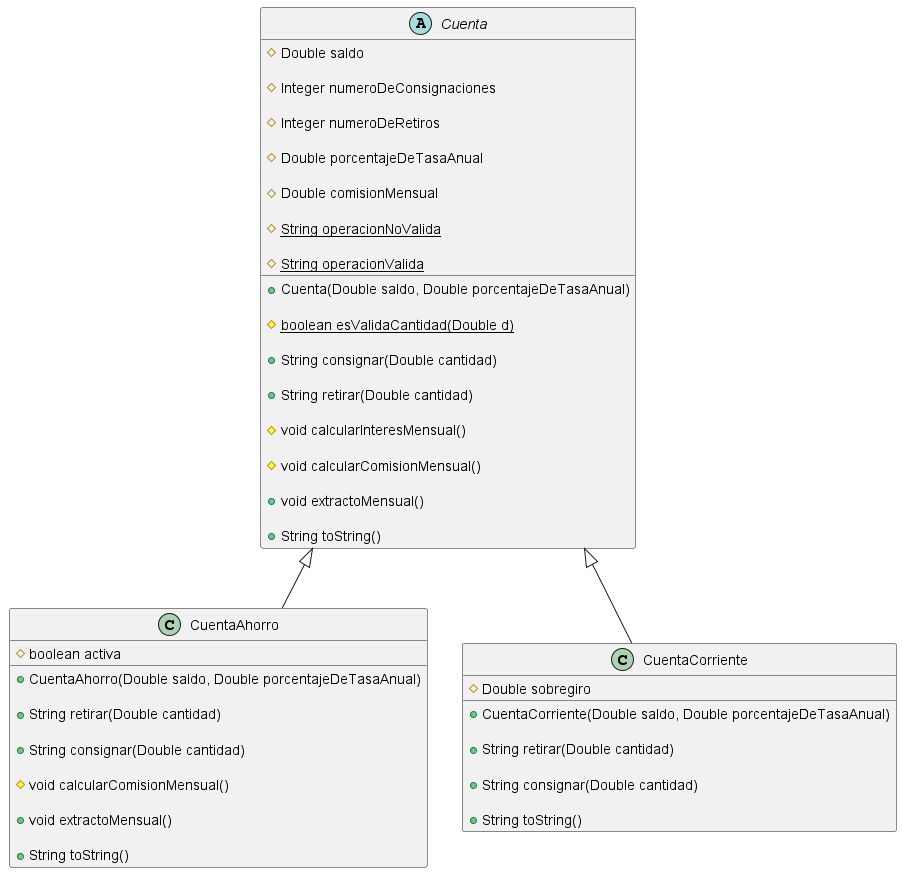

# Práctica de Herencias con Test JUnit

Este repositorio contiene un programa que modela una jerarquía de clases para cuentas bancarias, utilizando herencia y pruebas unitarias con JUnit.

---

## Requisitos del Programa

El programa debe modelar una **cuenta bancaria** con los siguientes atributos (de acceso protegido):

- **Saldo**: tipo `float`.
- **Número de consignaciones**: tipo `int`, inicializado en 0.
- **Número de retiros**: tipo `int`, inicializado en 0.
- **Tasa anual (porcentaje)**: tipo `float`.
- **Comisión mensual**: tipo `float`, inicializada en 0.

---

### Clase `Cuenta`

La clase `Cuenta` incluye un constructor que inicializa los atributos `saldo` y `tasa anual` con valores dados como parámetros. También define los siguientes métodos:

- **Consignar**: actualiza el saldo al depositar una cantidad de dinero.
- **Retirar**: actualiza el saldo al retirar dinero, siempre que no supere el saldo disponible.
- **Calcular interés mensual**: calcula y actualiza el saldo con base en la tasa anual.
- **Extracto mensual**: descuenta la comisión mensual y actualiza el saldo aplicando el interés mensual.
- **Imprimir**: retorna los valores actuales de los atributos.

---

### Clases Hijas

#### 1. **Cuenta de Ahorros**

Posee un atributo adicional para determinar si la cuenta está activa (`boolean`). Las condiciones son:

- La cuenta está **inactiva** si el saldo es menor a `$10,000`.
- La cuenta está **activa** si el saldo es mayor o igual a `$10,000`.

Se redefinen los siguientes métodos:

- **Consignar**: permite consignar dinero si la cuenta está activa. Invoca el método heredado.
- **Retirar**: permite retirar dinero si la cuenta está activa. Invoca el método heredado.
- **Extracto mensual**:
  - Si el número de retiros supera 4, cada retiro adicional genera una comisión de `$1,000`.
  - Determina si la cuenta está activa o inactiva según el saldo actual.
- **Imprimir**: retorna el saldo de la cuenta, la comisión mensual y el número total de transacciones (suma de consignaciones y retiros).

#### 2. **Cuenta Corriente**

Incluye un atributo adicional llamado **sobregiro** (inicializado en 0). Se redefinen los siguientes métodos:

- **Retirar**: 
  - Permite retirar dinero incluso si la cantidad supera el saldo.
  - El monto retirado que exceda el saldo se registra como sobregiro.
- **Consignar**:
  - Invoca el método heredado.
  - Si hay sobregiro, reduce el mismo con la cantidad consignada.
- **Extracto mensual**: invoca el método heredado.
- **Imprimir**: retorna el saldo de la cuenta, la comisión mensual, el número total de transacciones (suma de consignaciones y retiros), y el valor del sobregiro.

---

## Diagrama UML

